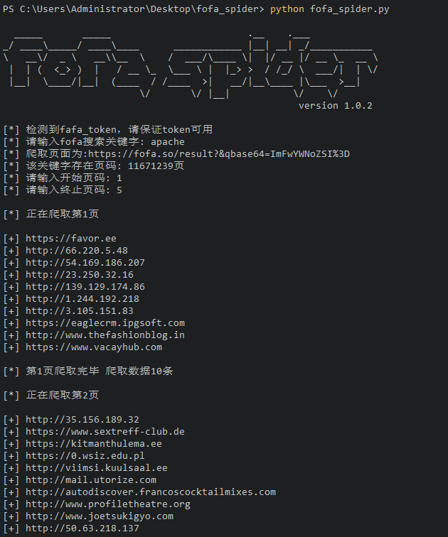
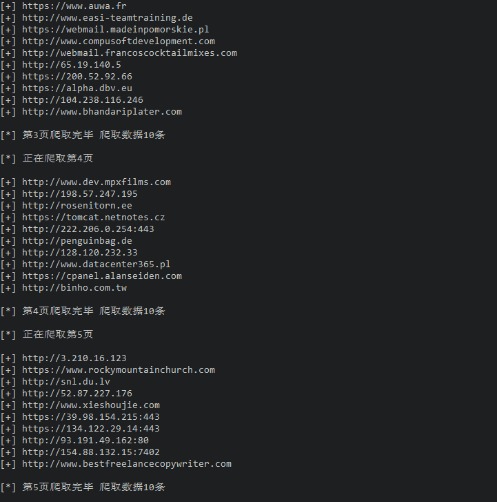

README

fofa改版，原来的爬虫不能用了。
所以新写一版
名为升级，其实已经换代了。

1.基于python3的fofa爬取

3.配置config.py中的cookie信息，用burp截个包，一看便明白了。

4.运行python3 fofa_spider.py

5.抓取结果保存在目录下fofa_result.txt

### 原理

目前非会员仍然只能抓取5页。
更多的抓取页面还没有时间写。

demo

如果你觉得好用，请给作者买杯咖啡

